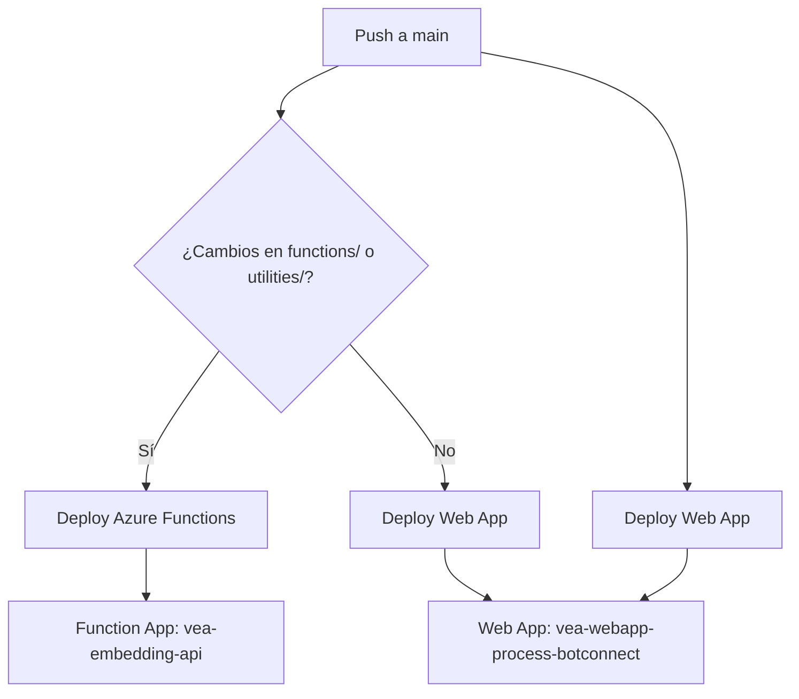

# Arquitectura Azure Functions - VEACONNECT

## 🏗️ **Arquitectura de Despliegue**

### **1. Azure Web App (Django)**
- **Nombre**: `vea-webapp-process-botconnect`
- **Propósito**: Aplicación web principal
- **Workflow**: `.github/workflows/azure_deploy.yml`
- **Trigger**: Push a `main`

### **2. Azure Function App (APIs)**
- **Nombre**: `vea-functions-apis`
- **Propósito**: API para embeddings y búsqueda semántica
- **Workflow**: `.github/workflows/azure_functions_deploy.yml`
- **Trigger**: Push a `main` (solo si cambian archivos en `functions/` o `utilities/`)

## 🔄 **Flujo de Despliegue**



## 📁 **Estructura de Archivos**

```
veaconnect-webapp-prod/
├── .github/workflows/
│   ├── azure_deploy.yml          # Web App deployment
│   └── azure_functions_deploy.yml # Functions deployment
├── functions/
│   ├── embedding_api_function.py # Main function
│   ├── host.json                 # Function configuration
│   ├── requirements.txt          # Function dependencies
│   └── local.settings.json       # Local settings
├── infra/
│   └── main.bicep                # Infrastructure (both apps)
└── utilities/
    └── embedding_manager.py      # Shared utilities
```

## 🚀 **Endpoints de la Function App**

### **Base URL**: `https://vea-embedding-api.azurewebsites.net/api`

| Endpoint | Método | Descripción |
|----------|--------|-------------|
| `/embeddings/create` | POST | Crear nuevo embedding |
| `/embeddings/get` | GET | Obtener embedding por ID |
| `/embeddings/update` | PUT | Actualizar embedding |
| `/embeddings/delete` | DELETE | Eliminar embedding |
| `/embeddings/search` | POST | Búsqueda semántica |
| `/embeddings/stats` | GET | Estadísticas |
| `/embeddings/health` | GET | Health check |

## ⚙️ **Configuración**

### **Variables de Entorno (Function App)**
```bash
FUNCTIONS_WORKER_RUNTIME=python
FUNCTIONS_EXTENSION_VERSION=~4
WEBSITE_RUN_FROM_PACKAGE=1
AZURE_POSTGRESQL_NAME=vea_database
AZURE_POSTGRESQL_USERNAME=vea_admin@vea-postgresql-server
AZURE_POSTGRESQL_PASSWORD=<password>
AZURE_POSTGRESQL_HOST=vea-postgresql-server.postgres.database.azure.com
REDIS_HOST=<vm-ip>
REDIS_PORT=6379
REDIS_PASSWORD=<password>
AZURE_STORAGE_CONNECTION_STRING=<connection-string>
AZURE_OPENAI_ENDPOINT=<endpoint>
AZURE_OPENAI_API_KEY=<api-key>
```

## 🔧 **Despliegue Manual**

### **1. Desplegar Infrastructure**
```bash
az deployment group create \
  --resource-group vea-rg \
  --template-file infra/main.bicep \
  --parameters postgresAdminPassword=<password> redisPassword=<password> djangoSecretKey=<secret>
```

### **2. Desplegar Web App**
```bash
# Se ejecuta automáticamente con GitHub Actions
# O manualmente:
cd .azure/webapps/micrositio-vea-connect
az webapp deployment source config-zip --resource-group vea-rg --name vea-webapp-process-botconnect --src webapp.zip
```

### **3. Desplegar Functions**
```bash
# Se ejecuta automáticamente con GitHub Actions
# O manualmente:
cd functions
func azure functionapp publish vea-embedding-api --python
```

## 🔍 **Monitoreo**

### **Web App**
- **URL**: `https://vea-webapp-process-botconnect.azurewebsites.net`
- **Logs**: Azure Portal → App Service → Log stream

### **Function App**
- **URL**: `https://vea-embedding-api.azurewebsites.net`
- **Logs**: Azure Portal → Function App → Functions → Logs

## 🔐 **Seguridad**

### **Service Principal Permisos**
- **Contributor** en la suscripción
- Acceso a App Service, Function App, Storage, PostgreSQL, etc.

### **Network Security**
- Functions acceden a PostgreSQL y Redis a través de VNet
- Storage Account con acceso privado

## 📊 **Costos**

### **Estimación Mensual**
- **Web App (B1)**: ~$13/mes
- **Function App (Consumption)**: ~$5-15/mes (depende del uso)
- **PostgreSQL (B1ms)**: ~$25/mes
- **Storage Account**: ~$2/mes
- **VM Redis (B2s)**: ~$26/mes
- **Total**: ~$71-81/mes

## 🚨 **Troubleshooting**

### **Problemas Comunes**

1. **Function no se despliega**
   - Verificar Azure Functions Core Tools
   - Revisar logs en Azure Portal

2. **Error de conexión a PostgreSQL**
   - Verificar variables de entorno
   - Comprobar firewall de PostgreSQL

3. **Error de Redis**
   - Verificar IP de la VM
   - Comprobar contraseña de Redis

### **Comandos de Diagnóstico**
```bash
# Verificar Function App
az functionapp show --name vea-embedding-api --resource-group vea-rg

# Ver logs de Function
az functionapp logs tail --name vea-embedding-api --resource-group vea-rg

# Ver configuración de Web App
az webapp config appsettings list --name vea-webapp-process-botconnect --resource-group vea-rg
``` 